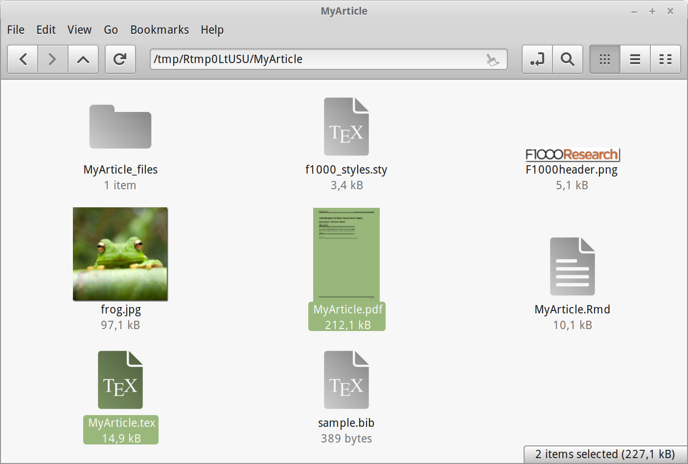

# Introduction

The intention of this package is to provide tools to assist in converting between Rmarkdown and LaTeX documents, specifically in the case where one is writing a workflow to be submitted to F1000Research, while hopefully also hosting a runable example on Bioconductor.  Reaching these two endpoints while maintaining a single working document can be challenging.  Submission to the journal requires a LaTeX file, which is best achieved by writing an Rnw workflow based on **Sweave** or **knitr**, while producing the html based versions hosted by Bioconductor is most easily achieved from an Rmarkdown document.  Tools such as **pandoc** will allow conversion between many formats, but there is still a high degree of manual intervention required when aiming to meet the specific formatting requirements of a journal publication.  

The current functionality assumes you have developed, or a planning to develop, a workflow in Rmarkdown, and aims to make the creation of a LaTeX document suitable for submission to F1000Research as straightforward as possible.

Before we can begin you need to install the library.  

```{r loadLibs, eval=FALSE}
source("http://www.bioconductor.org/biocLite.R")
biocLite('BiocWorkflowTools')
```

# Creating a new workflow document

## Using RStudio and our template

The BiocWorkflowTools package comes with an example Rmd file based upon the LaTeX article template supplied by F1000Research.  This defines the document structure for an F1000Research software article, and gives examples of how you can incorporate tables, figures and evaluated code in your Rmarkdown document.  These examples have all been tested to ensure they can be converted to LaTeX using this package.  If you are just starting out developing your workflow, this template is a good place to start.

The simplest way to access this is by working in the RStudio environment.  From here you can select *File*, *New File*, *R Markdown* from the menu at the top of the screen.  This will open a new window (seen in Figure \@ref(fig:RStudioNew))


```{r RStudioNew, echo = FALSE, out.width='90%', fig.align='center', fig.cap="Creation of a new article is integrated into RStudio.  The F1000Research template can be accessed via the 'new R Markdown document' menu option."}
knitr::include_graphics("Rstudio_newdoc.png")
```

From here you can select '*F1000Research Article*' and specify both the name for your new document and the location it should be created in.  Pressing *OK* will create a new sub-folder in this directory, which contains several files.  The most important of these is the **.Rmd** file, which now contains the template document structure for you to begin working with.  This file will have opened automatically in your RStudio session.  

You will also find four other files in this folder.  Two of these: **frog.jpg** and **sample.bib** are example files and are used to demonstrate how to include images and references in your document.  It is safe to remove or edit them if you are comfortable with how this works.  The remaining two files: **f1000_styles.sty** and **F1000header.png** are required for the formatting of the final article PDF we will generate and should not be changed.

## Working outside RStudio

If you don't want to work in the RStudio environment, you can still use the included template to create a new file.  The command below will create a folder named *MyArticle* within the current working directory, and this in turn will contain the template **MyArticle.Rmd** plus the four files mentioned in the previous section.

*In the code below the first two lines generate a temporary location we will use in this example.  For your own workflow you will likely want to specify a location directly.  If you do not provide an option here, the default is to use your current working directory*

```{r createDraft}
tmp_dir <- tempdir()
setwd(tmp_dir)

rmarkdown::draft(file = "MyArticle.Rmd", 
                 template = "f1000_article", 
                 package = "BiocWorkflowTools", 
                 edit = FALSE)
```

# Converting to LaTeX and PDF

While you are writing your Rmarkdown document (and indeed once it is complete), you will probably want to view the journal formatted PDF version or obtain a LaTeX source for submission to the journal.

If you're working in RStudio you can simply press the 'Knit' button at the top of the document pane.  This will execute the code chunks, convert the document to LaTeX and then compile this into a PDF.  All of these files are retained, and you will be able to find both the **.tex** and **.pdf** files in the same folder as the original **.Rmd**.

```{r newFiles, echo = FALSE, out.width='90%', fig.align='center', fig.cap="The complete set of files.  After 'knitting' both the LaTeX source file and PDF documents can be found alongside your Rmarkdown file."}

```

Working outside RStudio, you can achieve the same result by using the command `render()` from the `rmarkdown` package e.g.

```{r render, eval = FALSE}
rmd_file <- file.path(tmp_dir, 'MyArticle', 'MyArticle.Rmd')
rmarkdown::render(input = rmd_file)
```

# Article upload

Finally, we provide the function `uploadToOverleaf()` to upload the project directly to Overleaf (<http://www.overleaf.com>), the LaTeX authoring system F1000Research use for their submission process.  This step is entirely optional, and the output created by the previous steps can be uploaded manually.

The primary argument here is `files` to which you give the location of the directory containing your **.Rmd**, **.tex**, etc. files you have written.  `uploadToOverleaf()` will compress the containing folder into a zip file, and submit this to Overleaf.  If the upload is successful a URL will be returned, and if you use the argument `openInBrowser = TRUE` an browser window will open at the new project.  From here you can submit your article to the journal.

<!-- don't run this code chunk as we don't want to spam Overleaf -->
```{r upload, eval=FALSE}
library(BiocWorkflowTools)
workflow_dir <- file.path(tmp_dir, 'MyArticle')
uploadToOverleaf(files = workflow_dir, 
                 openInBrowser = TRUE)
```

# R session information

```{r sessionInfo, eval=TRUE}
sessionInfo()
```
